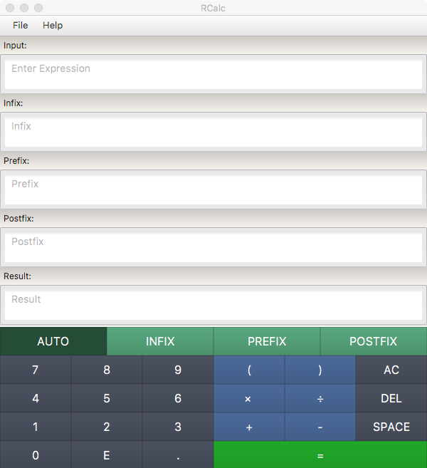
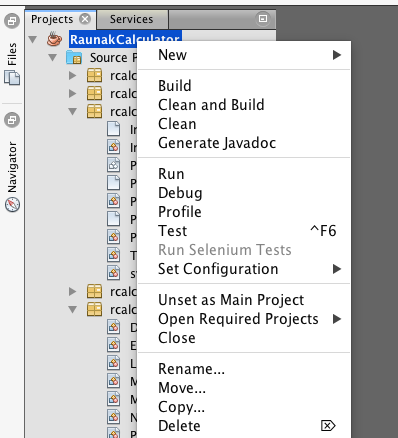

# Calculator Assignment
<p style="font-family: sans-serif; font-size: 9px;">
Raunak Mukhia<br>  
Student Id: 120049<br>  
Course: PLC, 2018<br>
</p>
## Introduction
<div style="text-align:center; width:100%">

</div>

This in report a Calculator is presented which has the following features
* Can evaluate
    * Infix Expression
    * Postfix Expression
    * Prefix Expression
* The numbers can be decimal numbers
* Has Multiply, Divide, Plus, Minus, Exponent(10^x) used in scientific notations, Left Parenthesis, Right Parenthesis and Unary Minus 
* The precedence of the operators in ascending order are Minus|Plus, Divide|Multiply, Exponent, Unary Minus and Parenthesis
* Can convert any type of (Infix, Postfix or Prefix) valid expression into any other type of expression.
* Has **three distinct phases**, Lexical Analysis which builds tokens, Syntax Analysis which build a parse tree and Translation which evaluates the result and translates into alternate expressions.

## Notes about Unary Operator
Unary operator which negates a number can be implements easily in Infix expression because its precedence is known. However for Postfix and Prefix expressions, unary operators can become ambiguous because Postfix and Prefix expressions don't have precedence.

For example, a postfix expression
```
3 2 - -
```
It is not clear whether 2 has to be negated, or the difference of 3 and 2 has to be negated. If 2 is negated then the result will be 5, if the difference is negated, then the result will be -1.

The same problem is applicable in prefix expression also,
```
- - 3 2
```
Here, the ambiguity will be whether 3 will be negated or the difference of 3 and 2 will be negative, which will give different results.

To overcome this, the postfix and prefix grammar has parenthesis.

In the postfix expression example above, if 2 needs to be negated, the expression should look like
```
3 (2 -) -
```
and if the difference of 3 and 2 needs to be negated, the expression should look like
```
(3 2 - -)   
```
The same applies for prefix expressions.

A more complex example would be
```
(3  (2 -) - -)
```
2 is negated, then then the difference of 3 and -2 = 5 is negated, the final answer is -5.

In short the when a term is negated with a unary operator it has to be enclosed within parenthesis.

Other than this parentheses does not have any meaning in postfix and prefix expressions as there are no precedence rules , and parentheses are never needed. 
Expressions such as 
```
(2 4 *) 4 +

+ ( * 2 4) 4
```
Will result in parsing error.

## Building and Running the Assignment

The Calculator is a *Netbeans* Project and has been intergrated into Netbean's Clean, Build and Run workflow. The project can be run using the Build and Run buttons in the toolbar. It can also be Cleaned, Build and Run by right-clicking the project.

<div style="text-align:center; width:100%">

</div>

> The build instructions are present in build.xml in the root directory of the project.

## Project Structure

The structure of the `src` directory of the project is as follows

```
src
├── rcalc                            This package tokenizes, parses, eveluates and translates
│   ├── lexer                           
│   │   ├── Calculator.jflex         JFlex file for tokenizing input string            
│   │   └── Token.java               Class for token
│   ├── parsers
│   │   ├── nonterminals             Non terminal nodes on the parse tree
│   │   │   ├── ASTERMNode.java
│   │   │   ├── FACTORNode.java
│   │   │   ├── MDTERMNode.java
│   │   │   ├── NUMNode.java
│   │   │   ├── PTERMNode.java
│   │   │   ├── STARTNode.java
│   │   │   └── TERMNode.java
│   │   ├── terminals                Terminal nodes on the parse tree
│   │   │   ├── DivideNode.java
│   │   │   ├── ExponentNode.java
│   │   │   ├── LParenNode.java
│   │   │   ├── MinusNode.java
│   │   │   ├── MultiplyNode.java
│   │   │   ├── NumberNode.java
│   │   │   ├── PlusNode.java
│   │   │   ├── RParenNode.java
│   │   │   └── TerminalNode.java    Super class of all terminal nodes, subclass of ParseNode
│   │   ├── Infix.cup                Infix cup file
│   │   ├── ParseNode.java           Super class of all nodes
│   │   ├── Postfix.cup              Postfix cup file
│   │   ├── Prefix.cup               Prefix cup file
│   │   └── Translation.java         Translation rules for evaluating and translating parse tree
│   └── Calculator.java              Exposes API for rcalc package
└── ui                               This package has the GUI component and main method
    ├── CalculatorUI.css               
    ├── CalculatorUI.fxml
    ├── CalculatorUIController.java     
    ├── HelpUI.fxml
    └── Main.java
```

## Parse Tree Generation

This assignment has three different *.cup* files for each types of expression
* Infix.cup
* Prefix.cup
* Postfix.cup

Each of the parsers generated by these files will build the parse tree with each node of the tree being the subclass of ParseNode.

```{.java}
PTERM       ::= LPAREN:l ASTERM:m RPAREN:r
                    {: RESULT = new PTERMNode(new LParenNode(l), m, new RParenNode(r)); :};

```

The above snippet is from *Infix.cup* and it means that while reducing `PTERM -> ( ASTERM )` it should create a new node in the parse tree with the first child being the `(` node, the second child being `ASTERM` node and the last child being `)` node.

Similarly for a valid expression it builds a parse tree up to the start symbol. 

For the example given above, a new object is create and its constructor is as follows

```{.java}
public PTERMNode(LParenNode n1, ASTERMNode n2, RParenNode n3) {
    super(n1, n2, n3);
    /* Infix Parser production */
    /* PTERM -> ( ASTERM ) */
    setProductionId(2);
}
```

Each object in the parse tree will have a production number associated with it, and each production has a unique production id.

## Evaluating the Parse Tree

Each Node object has a method which evaluates its value, using its production id and children nodes, and referring to `Translation.java` which has the translation rules for evaluating the expression. The whole parse tree is evaluated by evaluating each node using Depth First Traversal, up to the Root Node.


```{.java}
public double evaluate() throws Exception {
        double result = Translation.evaluate(this, getProductionId());
        setVal(result);
        return result;
    }
```
> The above method is in `ParseNode.java`, hence all its subclass inherit this method. 

## Translating Expression to other Forms

Similar to evaluation, each node has `toInfix()` , `toPrefix()` and `toPostfix()` methods. Using production id and children nodes , translation rules in `Translate.java` covert the expression into other forms. In this also Depth First Traversal is done.

```{.java}
 public String toPostfix() throws Exception {
        String expr = Translation.toPostfix(this, getProductionId());
        setPostfixExpr(expr);
        return expr;
    }
```
> `toPostfix` method in `ParseNode.java`.


## Modes
The calculator has 4 different modes
* Auto
* Infix
* Prefix
* Postfix

The user can select one of these modes and input the expression. 
**Auto** means that the calculator will automatically try to detect the expression type.


## Class Diagram


## Sequence Diagram
The following diagrams shows what happens when the user presses `'='` button or presses `Enter` on the keyboard.


> The above diagrams can be zoomed if the text's are too small without losing clarity.


